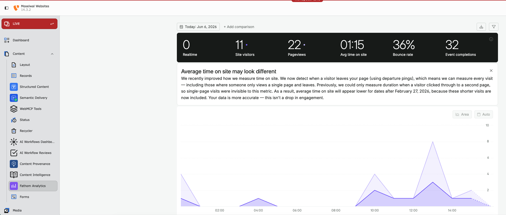
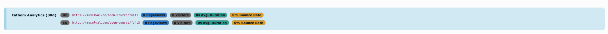

# Fathom Analytics — TYPO3 Extension

[](https://get.typo3.org/)
[](https://php.net/)
[](https://opensource.org/licenses/MIT)

Privacy-focused analytics for TYPO3 powered by [Fathom Analytics](https://usefathom.com/). Provides a backend dashboard module, page-specific analytics in the page module, and optional frontend tracking script injection.

## Features

- **Backend Dashboard Module** — View analytics data directly in the TYPO3 backend
- **Page-Specific Analytics** — See per-page metrics in the TYPO3 page module
- **Frontend Tracking** — Optional automatic injection of the Fathom tracking script
- **Dashboard Widgets** — Integration with TYPO3's Dashboard extension for custom widgets
- **TYPO3 14.x** — Tested on the current LTS line
- **Caching** — Uses TYPO3's Caching Framework for API response caching

## Screenshots

### Backend Dashboard



The dashboard module appears under **Content → Fathom Analytics** in the TYPO3 backend sidebar. It shows realtime visitors, daily pageviews, average time on site, bounce rate, and event completions — without leaving TYPO3.

### Per-Page Analytics Widget



The page analytics widget appears directly on every TYPO3 page record and shows the last 30 days of Fathom data (pageviews, visitors, avg. duration, bounce rate) for the DE and EN URL of that page.

## Installation

```bash
composer require moselwal/fa4t3
```

### Requirements

- PHP 8.5+
- TYPO3 14.x
- Fathom Analytics account with API key

### Secure Secret Management (Recommended)

For secure handling of your Fathom API key and password, we recommend using [`moselwal/secret-resolver`](https://packagist.org/packages/moselwal/secret-resolver):

```bash
composer require moselwal/secret-resolver
```

**Why not just environment variables?**

Environment variables are a common approach for secrets, but they have significant drawbacks:

- **Visible in plain text** at runtime — any process on the server, a `phpinfo()` call, or a debug dump can expose them.
- **No encryption at rest** — `.env` files and server configs store secrets unencrypted on disk.
- **Leak-prone** — environment variables are inherited by child processes, logged by error handlers, and often end up in CI/CD logs or container inspection output.

**What `secret-resolver` does differently:**

- Secrets can **encrypted at rest** in your repository (via SOPS/age), in Vault, or in other backends — and are only resolved at runtime.
- The decryption happens **outside your application** — the runtime environment (Docker Secrets, Vault Agent, etc.) provides the plaintext values. `secret-resolver` reads these resolved values and makes them available to TYPO3. The extension itself never handles encryption or decryption.
- Unlike environment variables, secrets are **not globally visible** in the process environment — they are resolved on demand and scoped to the consuming configuration.
- Supports multiple resolution strategies: **Docker Secrets** (`/run/secrets/`), **file-based env vars** (`KEY_FILE`), **HashiCorp Vault**, and others.

**Usage in TYPO3 YAML files:**

`secret-resolver` hooks into TYPO3's central `YamlFileLoader`, so the `%secret(KEY)%` placeholder works in **all** TYPO3 YAML configurations — not just Site Configuration:

```yaml
# config/sites/main/config.yaml
fa4t3ApiKey: '%secret(FA4T3_API_KEY)%'
fa4t3Password: '%secret(FA4T3_PASSWORD)%'
```

This includes Site Configuration, Form Framework definitions, Services.yaml, and any other YAML loaded through TYPO3's standard YAML loader.

See the [secret-resolver documentation](https://packagist.org/packages/moselwal/secret-resolver) for setup details.

## Architecture

```
Classes/
├── Controller/      # Backend module controllers
├── Domain/          # Models and repositories
├── Exception/       # Domain-specific exceptions
├── Middleware/       # Frontend tracking script injection
├── Service/         # Fathom API client and data services
└── Widgets/         # TYPO3 Dashboard widgets
```

## Configuration

1. Obtain an API key from your [Fathom Analytics dashboard](https://app.usefathom.com/)
2. Configure the extension in the TYPO3 backend (Extension Configuration)
3. Set your Site ID for frontend tracking (optional)

### Dashboard Widgets

When `typo3/cms-dashboard` is installed, additional widgets are available:

- Page views over time
- Top pages
- Referrer sources
- Browser/device breakdown

## Development

```bash
composer install
composer test                    # Unit tests
composer phpstan                 # Static analysis
vendor/bin/php-cs-fixer fix      # Code style (PER-CS3x0)
```

## Dependencies

| Package | Type | Purpose |
|---------|------|---------|
| `typo3/cms-dashboard` | Optional | Dashboard widget support |
| `moselwal/secret-resolver` | Optional | Secure API key and password resolution from encrypted sources |
| `moselwal/dev` | Dev | Shared QA tooling |

## License

MIT — see [LICENSE](LICENSE) and [LICENSES/MIT.txt](LICENSES/MIT.txt) for details.
